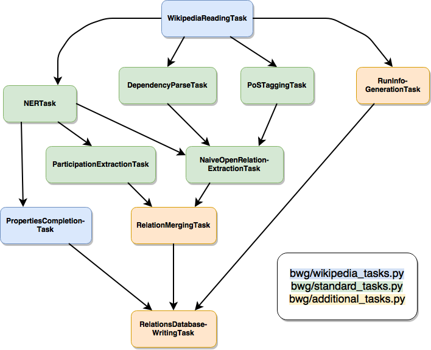

# README

## BigWorldGraph

This project is dedicated to make today's political sphere more transparent, visualizing the links between entities in 
power. This is achieved by automatically extracting those links from texts, utilizing techniques from [Natural Language 
Processing](https://en.wikipedia.org/wiki/Natural_language_processing) and enriching those results with 
[Wikidata](https://www.wikidata.org/wiki/Wikidata:Main_Page).

The data can then be inspected afterwards using an interactive graph.

### General information

The prototype of this project was developed during an internship at [MAJ // Digital](http://maj.digital/) in Lisbon in 2017. 
It is open-source (see LICENSE.md) and hoped to be improved upon by other volunteers (see section Contributing for more 
information). 

The project is intended to work with all kinds of texts in different languages; however, the prototype was developed to 
work with a corpus composed of Wikipedia articles of (political) affairs in France since 1996.

#### Project description

The project consists of two main parts: The NLP pipeline, extracting links between entities from text and storing them 
in a graph database as well as the front end using a graph visualization library.

#### Contributing

Contributions of all forms, be it code contributions, bug reports or suggestions are welcome. Please read the 
CONTRIBUTE.md file for more information or visit the [project's GitHub page](https://github.com/majdigital/bigworldgraph).

### Usage

#### Pipeline

##### Installation

To install all necessary python packages to run the pipeline, execute the following command in your terminal in the projects 
root directory:

    pip3 install -r requirements.txt
    
You also have to have [Neo4j](https://neo4j.com/download/) installed.

##### Data

Theoretically, the data can be any kind of text. The only prerequisite is to provide the data in a shallow XML format, e.g.

    <doc id="123456" url="www.url-to-text.com" title="The title or headline of this text.">
        The text that is going to be processed comes here.
    </doc>
    
You could start with creating your own corpus from Wikipedia, downloading a [Wikipedia XML dump](https://dumps.wikimedia.org/)
and following the instructions of the [MW-Dumper](https://www.mediawiki.org/wiki/Manual:MWDumper).

For steps involving Natural Languages Processing, appropriate [Stanford NLP](https://stanfordnlp.github.io/CoreNLP/download.html) models are also required.

##### Writing your own pipeline tasks

If you want to modify existing pipeline tasks or write new ones, it is recommended to add a new module to the `nlp` package,
see e.g. `nlp/french_wikipedia.py` as reference. You can inherit tasks from other modules to solve common problems:

* `nlp/standard_tasks.py`: Standard NLP tasks like PoS tagging, Dependency Parsing etc.
* `nlp/corenlp_server_tasks.py`: Same standard NLP tasks, but using the `Stanford CoreNLP server` instead to speed up 
cumbersome and slow tasks.
* `nlp/wikipedia_tasks.py`: Reading an input file in the shallow `MW-Dumper` XML format; extracting addtional information 
from Wikidata.
* `nlp/additional_tasks.py`: Creating a file with information about the current pipeline run, writing relationships into 
a graph database and more.

With its standard configuration, the pipeline comprises the following tasks:

##### Adjusting pipeline_config.py

##### Preparing

##### Running the pipeline

#### Graph visualization

#### Server deployment

## Warnings

* If you are using the project locally, on MacOS with Python > 3.4, you can only use one worker at a time for the 
pipline, otherwise running the pipeline will result in an exception being thrown.

A description of the project, TODO

TODO: How to install it
TODO: How to use it
* How to edit the config

* Example Affairs in french wikipedia
* Download
* MWDumper (https://www.mediawiki.org/wiki/Manual:MWDumper)
    * time bzcat frwiki-20161001-pages-articles.xml.bz2 | java -jar mwdumper-1.25.jar --format=xml --filter=titlematch:Affaire.* > affaire_pages.xml
    * bzip2 fr_affaire_pages.xml 
    * Wikipedia extractor (https://github.com/bwbaugh/wikipedia-extractor)
    * bzcat fr_affaire_pages.xml.bz2 | python WikiExtractor.py -cb 250K -o extracted -
    * find extracted -name '*bz2' -exec bunzip2 -c {} \; > text.xml
    
Commenting two lines (219) in nltk/parse/stanford.py when using utf-8 corpus, otherwise dependency parsing breaks.

* Starting CoreNLP Server:
    * java -mx4g -cp "*" edu.stanford.nlp.pipeline.StanfordCoreNLPServer -port 9000 -timeout 15000 -serverProperties StanfordCoreNLP-french.properties 

user-config.py for pywikibot

Neo4j installation

curl -gX GET http://127.0.0.1:5000/entities?"uid"="c34b43b3f3f74aa99ae012615b904760"
 MATCH (n)-[r]-(m), (m)-[r2]-(o)
WHERE n.uid = 'c34b43b3f3f74aa99ae012615b904760' 
RETURN n, o, m