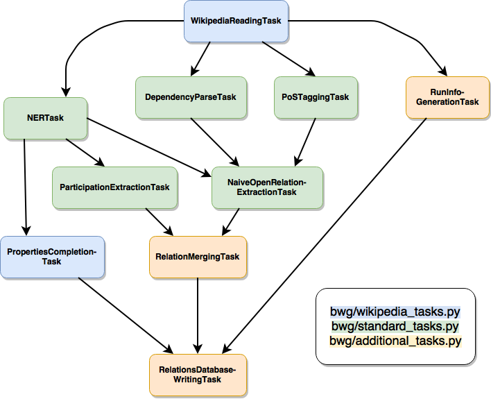

README
======

DISCLAIMER: This project is still in development and hasn't produced a
stable version yet.

BigWorldGraph
-------------

This project is dedicated to make today's political sphere more
transparent, visualizing the links between entities in power. This is
achieved by automatically extracting those links from texts, utilizing
techniques from `Natural Language
Processing <https://en.wikipedia.org/wiki/Natural_language_processing>`__
and enriching those results with
`Wikidata <https://www.wikidata.org/wiki/Wikidata:Main_Page>`__.

The data can then be inspected afterwards using an interactive graph.

General information
~~~~~~~~~~~~~~~~~~~

The prototype of this project was developed during an internship at `MAJ
// Digital <http://maj.digital/>`__ in Lisbon in 2017. It is open-source
(see LICENSE.md) and hoped to be improved upon by other volunteers (see
section Contributing for more information).

The project is intended to work with all kinds of texts in different
languages; however, the prototype was developed to work with a corpus
composed of Wikipedia articles of (political) affairs in France since
1996.

To see what future features are planned to be included in this project,
check TODO.md.

Project description
^^^^^^^^^^^^^^^^^^^

The project consists of two main parts: The NLP pipeline, extracting
links between entities from text and storing them in a graph database as
well as the front end using a graph visualization library.

Contributing
^^^^^^^^^^^^

Contributions of all forms, be it code contributions, bug reports or
suggestions are welcome. Please read the CONTRIBUTE.md file for more
information or visit the `project's GitHub
page <https://github.com/majdigital/bigworldgraph>`__.

Usage
~~~~~

Pipeline
^^^^^^^^

Installation
''''''''''''

Installation is handled by `Docker <https://www.docker.com/>`__, so make
sure to have it installed beforehand. If you need to have any passwords
included, add them to a ``.env`` file in the project root directory in
the ``PARAMETER_NAME=VALUE`` format. **By default, you must state a
password for the database using the parameter name** ``NEO4J_PASSWORD``.

Afterwards, the installation is fairly simple. Just go the root
directory of the project and execute the following command:

::

    docker-compose build && docker-compose up

The building of the docker images in this project might take a while,
especially during the first time you're using this project. After all
containers are running, you can run the pipeline by executing the
following:

::

    cd ./pipeline/
    docker run -v /var/run/docker.sock:/var/run/docker.sock -v `pwd`/stanford/models/:/stanford_models/ --name pipeline pipeline

If you are on a Windows system, replace ``pwd`` inside the ``-v`` flag
with the **absolute** path to the ``stanford/models`` directory.
Afterwards, you can make requests to the API using port ``6050`` by
default (see the documentation for ``bwg/run_api.py`` for more
information).

Data
''''

Theoretically, the data can be any kind of text. The only prerequisite
is to provide the data in a shallow XML format, e.g.

::

    <doc id="123456" url="www.url-to-text.com" title="The title or headline of this text.">
        The text that is going to be processed comes here.
    </doc>

You could start with creating your own corpus from Wikipedia,
downloading a `Wikipedia XML dump <https://dumps.wikimedia.org/>`__ and
following the instructions of the
`MW-Dumper <https://www.mediawiki.org/wiki/Manual:MWDumper>`__.

For steps involving Natural Languages Processing, appropriate `Stanford
NLP <https://stanfordnlp.github.io/CoreNLP/download.html>`__ models are
also required.

Writing your own pipeline tasks
'''''''''''''''''''''''''''''''

If you want to modify existing pipeline tasks or write new ones, it is
recommended to add a new module to the ``bwg`` package, see e.g.
``bwg/french_wikipedia.py`` as reference. You can inherit tasks from
other modules to solve common problems:

-  ``bwg/standard_tasks.py``: Standard NLP tasks like PoS tagging,
   Dependency Parsing etc.
-  ``bwg/corenlp_server_tasks.py``: Same standard NLP tasks, but using
   the ``Stanford CoreNLP server`` instead to speed up cumbersome and
   slow tasks.
-  ``bwg/wikipedia_tasks.py``: Reading an input file in the shallow
   ``MW-Dumper`` XML format; extracting addtional information from
   Wikidata.
-  ``bwg/additional_tasks.py``: Creating a file with information about
   the current pipeline run, writing relationships into a graph database
   and more.

With its standard configuration, the pipeline comprises the following
tasks:

Adjusting your pipeline configuration
'''''''''''''''''''''''''''''''''''''

If you add a new kind of task to the pipeline, make sure to include a
description of its necessary parameters in your pipeline configuration
file. You can use ``bwg/raw_pipeline_config.py`` as a template, which
provides a minimal example.

::

    CONFIG_DEPENDENCIES = {
        ...
        # Your task
        "my_new_task": [
             "{language}_SPECIFIC_PARAMETER", 
             "LANGUAGE_INDEPENDENT_PARAMETER"
        ],
        ...
    }

Then you have to include those declared parameters somewhere in your
config file:

::

    # My config parameters
    ENGLISH_SPECIFIC_PARAMETER = 42
    LANGUAGE_INDPENENDENT_PARAMETER = "yada yada"

If you implement tasks that extend the pipeline to support other
language, please add it to the following list:

::

    SUPPORTED_LANGUAGES = ["FRENCH", "ENGLISH"]

Finally, create a module for your own pipeline (e.g.
``bwg/my_pipeline.py``) and build the configuration before running the
pipeline, using the pre-defined task names in your pipeline file:

::

    import luigi
    from bwg.nlp.config_management import build_task_config_for_language

    class MyNewTask(luigi.Task):
        def requires():
            # Define task input here
            
        def output():
            # Define task output here
            
        def run():
            # Define what to do during the task here
            

    if __name__ == "__main__":
        task_config = build_task_config_for_language(
            tasks=[
                "my_new_task"
            ],
            language="english",
            config_file_path="path/to/pipeline_config.py"
        )
        
        # MyNewTask is the last task of the pipeline
        luigi.build(
            [MyNewTask(task_config=task_config)],
            local_scheduler=True, workers=1, log_level="INFO"
        )

Graph visualization
^^^^^^^^^^^^^^^^^^^

TODO: How to install and use

Server deployment
^^^^^^^^^^^^^^^^^

TODO: How to
